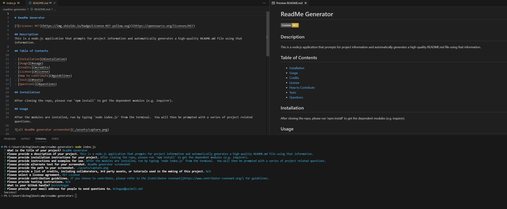

# ReadMe Generator

## Description
This is a node.js application that prompts for project information and automatically generates a high-quality README.md file using that information.  

## Table of Contents

- [Installation](#installation)
- [Usage](#usage)
- [Credits](#credits)
- [License](#license)
- [How to Contribute](#guidelines)
- [Tests](#tests)
- [Questions](#questions)

## Installation

After cloning the repo, please run 'npm install' to get the dependent modules (e.g. inquirer).

## Usage

After the modules are installed, run by typing 'node index.js' from the terminal.  You will then be prompted with a series of project related questions.

[Demo Video](https://youtu.be/Wr1VyWIsC-I)

## Credits

N/A

## License

This application is covered under the MIT License.

## How To Contribute

If you choose to contribute, please refer to the [Contributor Covenant](https://www.contributor-covenant.org/) for guidelines.

## Tests

N/A

## Questions

[GitHub Profile](https://github.com/kevinchogan)

For questions, please contact kchogan@pacbell.net.
